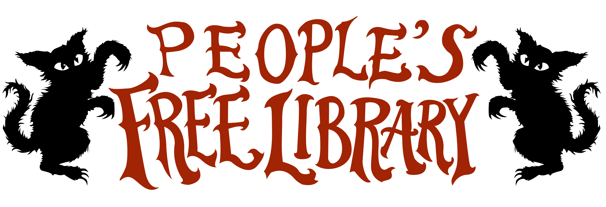

# 

**Antifascist Street Library and Press (+ Really Really Free Market Ⓐ 🏴)**  
Every Friday 1-4 @ Kenton Park

---

This repository contains a growing library of zines that are available at the street library.

* `_layout/` contains the HTML template for the [website](https://peoplesfreelibrary.info)
* `_data/` contains the YAML formatted metadata describing each zine to the template engine
* `style.css` is the theme that styles the website
* `search.js` implements the search/filter functionality
* `books/` contains all of the actual PDF files for the zines

To add a new title, first add the PDF to `books/` using the follwing convention:

```
books/the-title-of-the-zine/ForPrinting-LANGUAGE.pdf
books/the-title-of-the-zine/DigitalReading-LANGUAGE.pdf
```

Then, edit `_data/books.yml`, adding a new block that contains the following:

```yml
- title: The Title of the Zine
  summary: A summary or subtitle that is searchable on the website 
  tags: 
    - topic tags
    - each one
    - is also searchable
  links:
    - name: For Printing (Language)
      file: ../books/the-title-of-the-zine/ForPrinting-LANGUAGE.pdf
    - name: Digital Reading (Language)
      file: ../books/the-title-of-the-zine/ForPrinting-LANGUAGE.pdf
```

That's all! The website is automatically built and deployed when the repository is updated.
